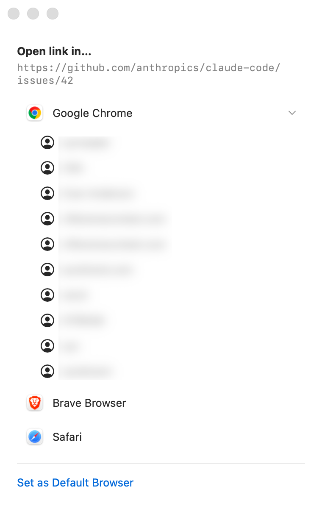

# Select Browser

A tiny macOS app you set as your **default browser**. Instead of opening links
automatically, it pops up a window asking *which browser* (and *which profile*)
you want to open the link in.

Supports **Google Chrome**, **Brave**, and **Safari**. For Chrome and Brave it
also lets you pick a specific profile.



## How it works

When you click a link anywhere on your Mac, macOS hands the URL to your default
browser. With Select Browser set as the default, it instead:

1. Catches the incoming URL.
2. Shows the picker above.
3. Opens the link in the browser (and profile) you choose.

Chrome/Brave profiles are read from each browser's `Local State` file, and the
link is launched with `--profile-directory` so it lands in the right profile.

## Build & install

Requires the Xcode Command Line Tools (Swift 6, macOS 26 SDK).

```bash
./build.sh
```

This compiles the Swift sources, ad-hoc signs the app, and installs a **single
canonical copy** to `/Applications/Select Browser.app` (build artifacts stay in
`build/`). Keeping just one copy with this bundle id matters — duplicate copies
confuse LaunchServices about which one is the real handler.

## Use

1. Launch `/Applications/Select Browser.app`.
2. Click **Set as Default Browser**
   (or set it under *System Settings → Desktop & Dock → Default web browser*).

That's it — links will now open the picker. Close the window or press ⌘Q to quit.

## Adding more browsers

Any Chromium-based browser (Edge, Arc, Vivaldi, …) is a one-line addition to the
`known` list in [`Sources/Browsers.swift`](Sources/Browsers.swift); profiles and
launching work automatically.
